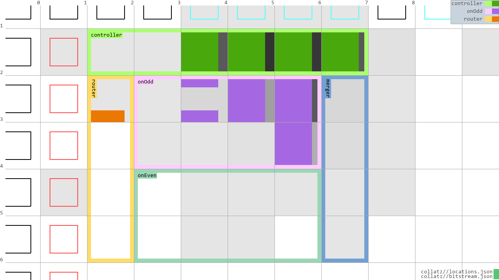
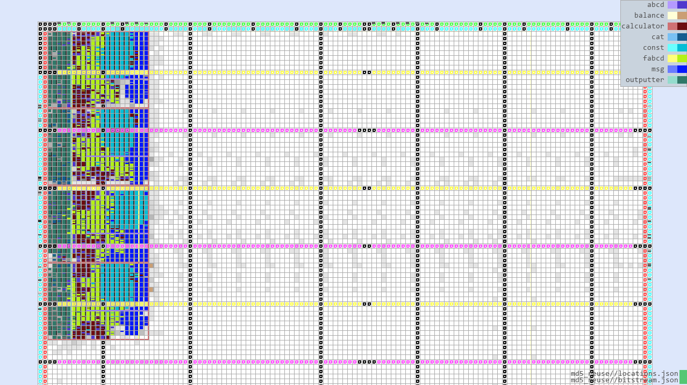
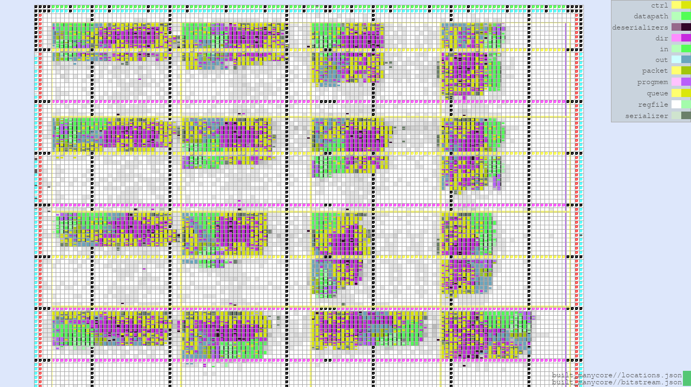
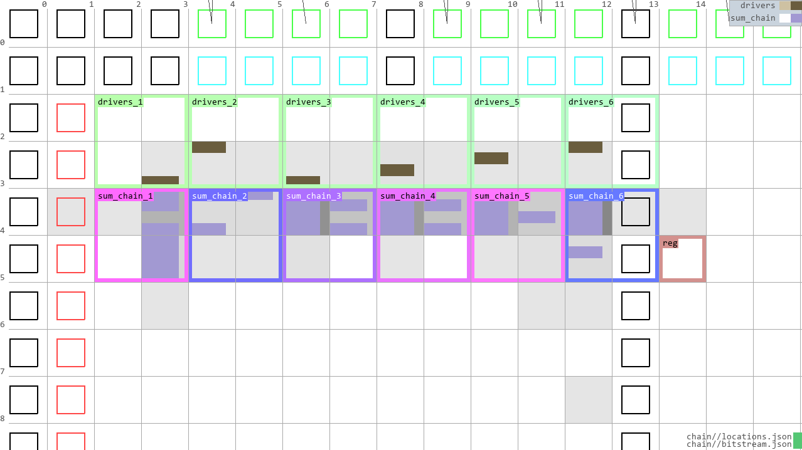
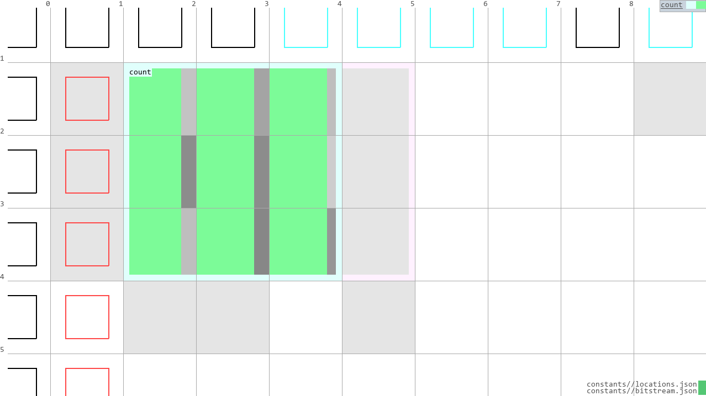
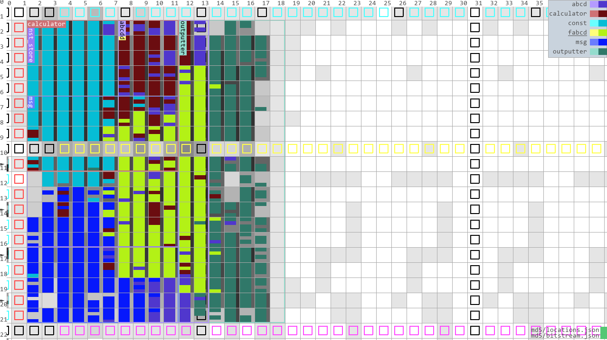
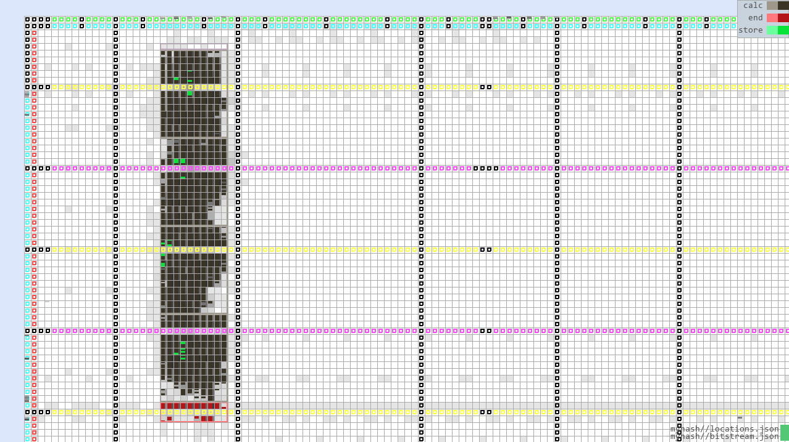
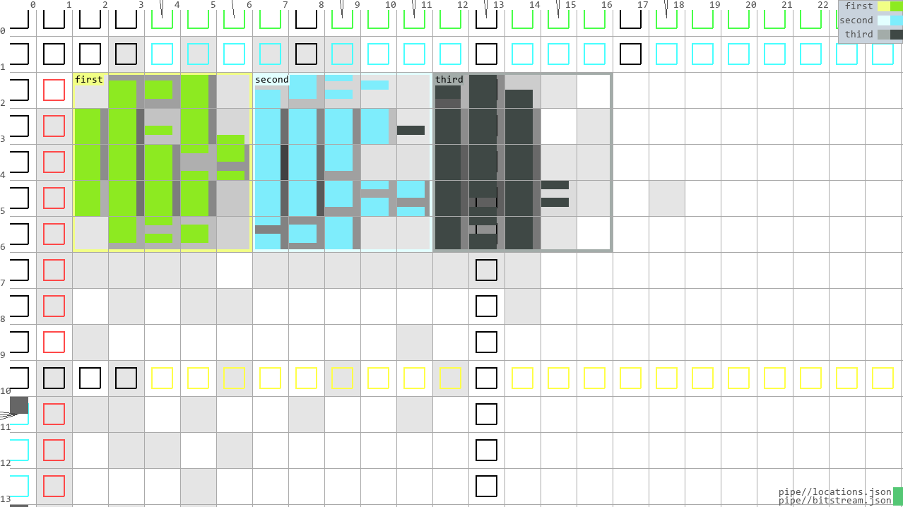
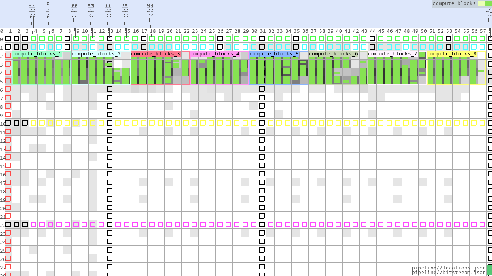
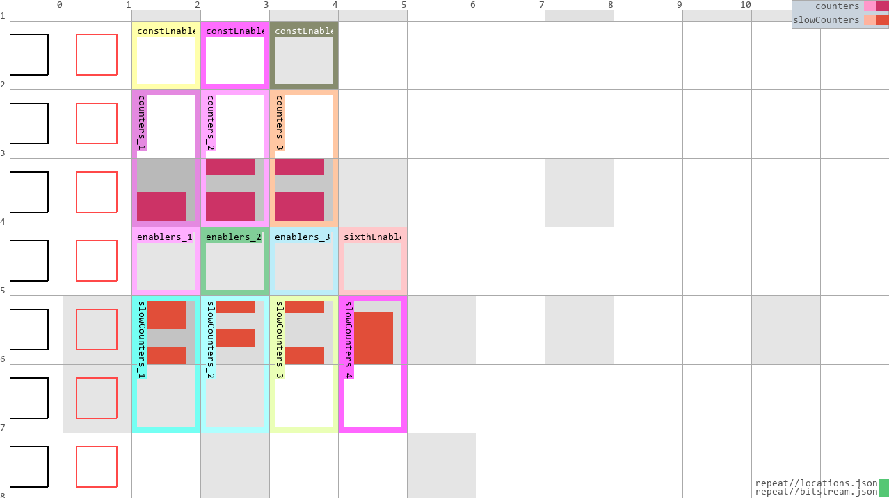

- [Examples](#examples)
- [Paper Examples](#paper-examples)
  - [`collatz`](#collatz)
  - [`md5_reuse`](#md5_reuse)
  - [`manycore`](#manycore)
- [Feature Testing Examples](#feature-testing-examples)
  - [`chain`](#chain)
  - [`constants`](#constants)
  - [`core`](#core)
  - [`md5`](#md5)
  - [`md5_parallel`](#md5_parallel)
  - [`myhash`](#myhash)
  - [`pipe`](#pipe)
  - [`pipeline`](#pipeline)
  - [`repeat`](#repeat)
  - [`router`](#router)
  - [`smallnet`](#smallnet)

# Examples

In [the examples folder](https://github.com/PietPtr/Ex-PART/tree/main/examples) you will find several examples developed to test Ex-PART features and to research how well the ideas Ex-PART tries to implement work. Here we detail what their use is and what features they employ. The chapter titles here correspond with (and link to) the folders the example is located in.

For every example a demonstration of how to run it in clashi is provided.

To best understand this document it is recommended to first read the [programming manual](programming.md).

# Paper Examples
These three examples are used in the paper. 

## [`collatz`](../examples/collatz/)
The Collatz conjecture calculator. In both the [programming manual](programming.md) and the paper this example is explained in much detail. 

```haskell
*Main> simulate @System system [Nothing, Just 5, Nothing, Nothing, Nothing, Nothing, Nothing]
[0,0,5,16,8,4,2,1,*** Exception: X: finite list
```



## [`md5_reuse`](../examples/md5_reuse/)
Most readable code of the four-way parallel MD5 hash calculator. [`md5_parallel`](../examples/md5_parallel/) describes exactly the same hardware, had the system copied manually to instantiate four hashers. In `md5_reuse` system instantiation is used instead.

This design implements four parallel components that compute the MD5 hash of incoming 128-bit messages. Every cycle 32 bits of a message can come in and are stored until the entire message has arrived. When an entire message has arrived, the message is transferred to one of the hashers in a round-robin fashion by the `load_balance_4` component. 64 cycles after the entire message has been transferred, the hasher will emit the 128-bit hash in four 32-bit messages and the `cat_4_maybes` makes sure exactly one hash is put on the output. Since every hasher takes the same amount of time, the order of the hashes on the output is exactly the same as the order on the input.

The [pseudocode shown on Wikipedia](https://en.wikipedia.org/wiki/MD5#Pseudocode) was followed. Since the messages are always 128-bit, the outer for-loop is unnecessary: everything is already in a 512-bit chunk. The inner for-loop contains 64 steps that compute the hash by (inter)changing the 32-bit variables A, B, C, and D. To achieve this in hardware, these variables are stored in four registers. For 64 cycles, their values are sent into a multiplexer, and based on a cycle counter (`i` in the pseudocode) their values are sent to the correct computation path. To performe these computations, constants are necessary. Two constant stores, for `K` and `s`, are included in the system. The correct value is selected from the store based on the cycle counter (this is also why every instantiation of the MD5 hasher has its own store, it needs a value every cycle, and we would need 4-port read memory to achieve this with just one memory). At the end of the process the found values for A, B, C, and D are added to constants defined by MD5 (a0, b0, c0, and d0 in the pseudocode) to produce the final result.

```haskell
*Main> simulate @System system $ 
    [Just 0, Just 0, Just 0, Just 0, -- First message
     Nothing, Nothing, -- pause
     Just 1, Just 0, Nothing, Just 0, Just 0] -- second message with break inbetween
    L.++ (L.take 69 $ L.repeat Nothing)
[Nothing,Nothing,Nothing,Nothing,Nothing,Nothing,Nothing,Nothing
,Nothing,Nothing,Nothing,Nothing,Nothing,Nothing,Nothing,Nothing
,Nothing,Nothing,Nothing,Nothing,Nothing,Nothing,Nothing,Nothing
,Nothing,Nothing,Nothing,Nothing,Nothing,Nothing,Nothing,Nothing
,Nothing,Nothing,Nothing,Nothing,Nothing,Nothing,Nothing,Nothing
,Nothing,Nothing,Nothing,Nothing,Nothing,Nothing,Nothing,Nothing
,Nothing,Nothing,Nothing,Nothing,Nothing,Nothing,Nothing,Nothing
,Nothing,Nothing,Nothing,Nothing,Nothing,Nothing,Nothing,Nothing
,Nothing,Nothing,Nothing,Nothing,Nothing,Nothing,Nothing
,Just 869400926,Just 2891193117,Just 428080646,Just 1142714583 -- First hash appears
,Nothing,Nothing,Nothing
,Just 540878663,Just 3516292304,Just 2802766885,Just 4124385854 -- Second hash appears three cycles later
,*** Exception: X: finite lis
```
The message consisting of four words of zeroes is loaded in (128 bits, all zero), and 64 cycles later the hash appears. Two cycles after the first message, a different message (with just one bit set) is loaded in, with a one cycle pause between the second and third word. This second message is sent to the second hasher and both hashes are computed in parallel.



## [`manycore`](../examples/manycore/)
The manycore as described in the paper. The basic idea of the manycore is that it is a grid of "PRUs": Processing and Routing Units. These units contain a very simple processor and a router. Routers receive packets from their core, and send them to the correct router based on a 4-bit x and y coordinate. When a router receives a packet destined for that location, it sends it to its core.

The `haskell` block of this design is quite large. It contains data types both for the instructions for the processor, and for instructions to the FIFO. Many type synonyms are defined here as well. Two functions, `decode` and `encode`, convert 8-bit representations of instructions to and from the `Instruction` data type. The `Instruction` data type is 10 bits, but we only need 8 to actually store all the information we need. A lot of test inputs for several components is present in this `haskell` block too, and the program (`default_prog`) that is burned into the core (cores are not reprogrammable, the program memory is synthesized into the design). Initial states for many states used in components are defined as well as functions with no arguments and with names like `empty_*`. To do easy conversion from locations on the grid (two 4-bit numbers in a tuple) to 8-bit numbers (the type that goes over the bus between routers), the functions `int2loc` and `loc2int` are used. Data types for states of components are defined here as well.

Components defining the processor are: 
- `datapath`: Contains the ALU and logic for manipulating incoming data from the registers, and calculates new values for registers. Also manages program counter updates (both the regular incrementation and jumps), and sends commands to the FIFO managing outgoing packets of this core.
- `registers`: The register file of the core: four 8-bit registers are available. Register 0 is constant zero when read from, and discards values when written to. Allows selection of two registers in one cycle.
- `prog_mem`: The program memory, simply always sends the value pointed to on its input to its output. As its state is never modified, it can be synthesized as a combinatorial circuit. The size of this circuit depends on the program burned in the core. The default program waits for inputs it receives (`ReadFIFO` is blocking), and then adds it to a summing register. When it receives the value zero it sends the result of the sum to (4, 5), i.e. the output of the manycore.

Components for managing the outgoing packet queue and the incoming data queue between the router and the processor are:
- `in_fifo`: The FIFO for incoming data from the router. Code taken from an [an example given by Clash](https://github.com/clash-lang/clash-compiler/blob/master/examples/Fifo.hs). 
- `queue_controller`: `in_fifo` uses quite a different style of arguments from the rest of the system, so this FIFO is controlled by this component. It translates `FIFOCommands` from the processor (to read data) and the router (to push data) to correct signals for the `in_fifo`.
- `packet_queue`: Very similar FIFO to in_fifo, just with some types changed (sadly means that some code had to be copied, as Ex-PART does not allow for most of the pretty abstractions that Clash does). 
- `packet_control`: similar job to `queue_controller`, just with the packet queue. A large difference is that the packet queue is a queue of type `Packet`, which is built up by two writes from the processor: first for the 8-bit coordinate (4 bits for x and 4 bits for y), then for the 8-bit value. This component saves the location and waits until the processor has pushed the value, then it pushes the entire assembled packet to the `packet_queue`.

Routers send packets in two cycles: one for the address and one for the data. Every router starts with the same state, and is thus synchronized. Therefore every router knows exactly what to expect on what cycle: either two cycles of no data, or one cycle of location data and one cycle of value data. The router is built from the following components:
- `pkt_ser`: "packet serializer", serializes the 16-bit packet by splitting it up into two packets of 8 bits.
- `pkt_des`: "packet deserializer", combines incoming 8-bit data over two cycles to one 16-bit packet.
- `direction_decider`: Given some incoming packet, determine to which direction it should go. It uses a _very_ simple decision procedure for this, defined in the if/else tree for `pick_packet`. If several packets arrive at once one of the packets is dropped.

Since every input and output port must be connected to something in Ex-PART, the `cap` component exists. It takes some PRU's output data and does nothing with it, and drives the input of that PRU with Nothing.

The layout of the manycore is done by defining a `pru` hierarchy. This system is chained four times in a vertical manner. Chain can only chain one input/output, so the remaining vertical connections in the other directions are defined manually. The horizontal connections are defined by using multiconnections. Constant drivers supply x and y coordinates to the routers, so they know where in the grid they are located. These coordinates are 1-indexed.

All around the perimeter of the grid caps are inserted, except at the west input of the top left component, and at the south output of the bottom right component. This input and output are connected to the I/O pins of the FPGA and are used to supply outside data to the system and retrieve data from the system.

For test runs the test input `mc_input` is provided, run it like this:
```haskell
*Main> simulate @System manycore mc_input
[Nothing,Nothing,Nothing,Nothing,Nothing,Nothing,Nothing
,Nothing,Nothing,Nothing,Nothing,Nothing,Nothing,Nothing
,Nothing,Nothing,Nothing,Nothing,Nothing,Nothing,Nothing
,Nothing,Nothing,Nothing,Nothing,Nothing,Nothing,Nothing
,Nothing,Nothing,Nothing,Nothing,Nothing,Nothing,Nothing
,Nothing,Nothing,Nothing,Nothing,Nothing,Nothing,Nothing
,Nothing,Nothing,Nothing,Nothing,Just 69,Just 10,Just 69,Just 26,
```
This input sends two numbers to two different cores, which send their result to address 69, which is (4, 5) (`shiftL 4 4 + 5 = 69`), i.e. the bottom right, where the output is located, hence two packets have arrived at the output, the sums of the inputs.



# Feature Testing Examples
To test Ex-PART's features, examples where defined. This resulted in a nice library of examples, their purposes and workings are explained in this chapter.

## [`chain`](../examples/chain/)
Demonstrates chain with a combinational summing structure. the `summer` component takes two inputs: a 6-bit partial sum and a 2-bit number to add to partial sum. Chaining the output of one instance to the the partial sum input of another creates a chain that sums all the inputs. 

The summers need inputs, so the `sum_driver` provides these. It simply cycles through all values of an `Unsigned 2` over four cycles.

To show multiconnections and component accessors, the first component of the chain is driven by a constant value in line 20 of the `.expi`. A multiconnection connects the sum chain and the repetition of drivers.

```haskell
*Main> L.take 10 $ simulate @System system []
[0,0,6,12,18,0,6,12,18,0 -- continues for ever
```



## [`constants`](../examples/constants/)
Demonstrates constant drivers. A counter that must be enabled and has a configurable interval is driven by two constant values. The three most significant bits of the counter are sent to the output.

```haskell
*Main> L.take 500 $ simulate @System system []
[0,0,0,0,0,0,0,0,0,0,0,0,0,0,0,0,0,0,0,0,0,0,0,0,0,0,0,0,0,0,0,0,0,0
,0,0,0,0,0,0,0,0,0,0,0,0,0,0,0,0,0,0,0,0,0,0,0,0,0,0,0,0,0,0,0,0,0,0
,0,0,0,0,0,0,0,0,0,0,0,0,0,0,0,0,0,0,0,0,0,0,0,0,0,0,0,0,0,0,0,0,0,0
,0,0,0,0,0,0,0,0,0,0,0,0,0,0,0,0,0,0,0,0,0,0,0,0,1,1,1,1,1,1,1,1,1,1
,1,1,1,1,1,1,1,1,1,1,1,1,1,1,1,1,1,1,1,1,1,1,1,1,1,1,1,1,1,1,1,1,1,1
,1,1,1,1,1,1,1,1,1,1,1,1,1,1,1,1,1,1,1,1,1,1,1,1,1,1,1,1,1,1,1,1,1,1
,1,1,1,1,1,1,1,1,1,1,1,1,1,1,1,1,1,1,1,1,1,1,1,1,1,1,1,1,1,1,1,1,1,1
,1,1,1,1,1,1,1,1,1,1,1,1,1,1,2,2,2,2,2,2,2,2,2,2,2,2,2,2,2,2,2,2,2,2
,2,2,2,2,2,2,2,2,2,2,2,2,2,2,2,2,2,2,2,2,2,2,2,2,2,2,2,2,2,2,2,2,2,2
,2,2,2,2,2,2,2,2,2,2,2,2,2,2,2,2,2,2,2,2,2,2,2,2,2,2,2,2,2,2,2,2,2,2
,2,2,2,2,2,2,2,2,2,2,2,2,2,2,2,2,2,2,2,2,2,2,2,2,2,2,2,2,2,2,2,2,2,2
,2,2,2,2,3,3,3,3,3,3,3,3,3,3,3,3,3,3,3,3,3,3,3 -- continues for ever
```




## [`md5`](../examples/md5/)
Implementation of _one_ MD5 hasher. This implementation was copied to build `md5_reuse` and `md5_parallel`. See the chapter on `md5_reuse` for more information on the MD5 hasher.

```haskell
*Main> simulate @System system $ [Just 0, Just 0, Just 0, Just 0] L.++ (L.take 69 $ L.repeat Nothing)
[Nothing,Nothing,Nothing,Nothing,Nothing,Nothing,Nothing,Nothing,Nothing,Nothing
,Nothing,Nothing,Nothing,Nothing,Nothing,Nothing,Nothing,Nothing,Nothing,Nothing
,Nothing,Nothing,Nothing,Nothing,Nothing,Nothing,Nothing,Nothing,Nothing,Nothing
,Nothing,Nothing,Nothing,Nothing,Nothing,Nothing,Nothing,Nothing,Nothing,Nothing
,Nothing,Nothing,Nothing,Nothing,Nothing,Nothing,Nothing,Nothing,Nothing,Nothing
,Nothing,Nothing,Nothing,Nothing,Nothing,Nothing,Nothing,Nothing,Nothing,Nothing
,Nothing,Nothing,Nothing,Nothing,Nothing,Nothing,Nothing,Nothing,Nothing,Nothing
,Nothing,Just 869400926,Just 2891193117,Just 428080646,Just 1142714583
,*** Exception: X: finite list
```
Computing the hash of the 128 zeroes message on one hasher.



## [`myhash`](../examples/myhash/)
Demonstrates that systems can be used in chains and repeats. It implements a custom "hashing" algorithm: it applies a computation that's inspired by MD5, just simplified very much and with unproven effectiveness. This was done because the MD5 system was quite unwieldy to work with, so using a smaller hashing algorithm is nicer to demonstrate everything with.

The chain at line 23 chains the system `calc_sys` defined in line 10-21.

```haskell
*Main> simulate @System system [Just 5, Nothing]
[Nothing,Nothing,Nothing,Nothing,Nothing,Just 3090003402,*** Exception: X: finite list
```




## [`pipe`](../examples/pipe/)
A similar component as [`pipeline`](#pipeline) is used, but instead of it being chained it is instantiated three times and connected manually. This is a simple example that was used in a presentation to demonstrate Ex-PART's main features.

```haskell
*Main> simulate @System system [14,13,23,4]
[0,0,0,5,1,7,16,*** Exception: X: finite list
```




## [`pipeline`](../examples/pipeline/)
Demonstrates a larger design than Collatz to examine how synthesis times are affected by Ex-PART's strategies.

Consists of one component, `compute`, that sets its state to its input, and applies a hardware-unfriendly computation to its state to compute its output:
```haskell
    out = (s * 13) `mod` 17 - 4
```
Multiplication and modulo are very simple expressions, but they generate a lot of hardware.

Eight of these `compute` components are chained to form a simple pipeline. The computation is obviously not very relevant, this hardware design only intends to show how Ex-PART deals with a larger designs (this design was first defined a little after Collatz was built, hence it was one of the largest at the time).

```haskell
*Main> simulate @System system [14,13,23,4]
[65532,65532,65532,65532,65532,65532,65532,65532,10,9,6,3,*** Exception: X: finite list
```




## [`repeat`](../examples/repeat/)
Demonstrates both repeat and several features of multiconnections.

The design describes 4 rows: 2 rows of counters and 2 rows enablers, the enablers decide whether counters continue, and the result of the first row of counters is used to enable the second row of counters. The second row of counters is wider than the first. Viewing this in the visualizer makes things most clear (see below example command)

The slightly irregular layout allows demonstrating both the `:`-multiconnections and ranges for multiconnections.

```haskell
*Main> mapM_ print $ simulate @System system []
(0,0,0,0,0)
(1,1,0,0,0)
(2,2,1,1,1)
(3,3,1,1,1)
(4,4,2,2,2)
(5,5,2,2,2)
(6,6,3,3,3)
(7,7,3,3,3)
(8,8,4,4,4)
(9,9,4,4,4)
(10,10,5,5,5)
(11,11,5,5,5)
(12,12,6,6,6)
(13,13,6,6,6)
(14,14,7,7,7)
(15,15,7,7,7)
(0,0,8,8,8)
-- ...etc
```




